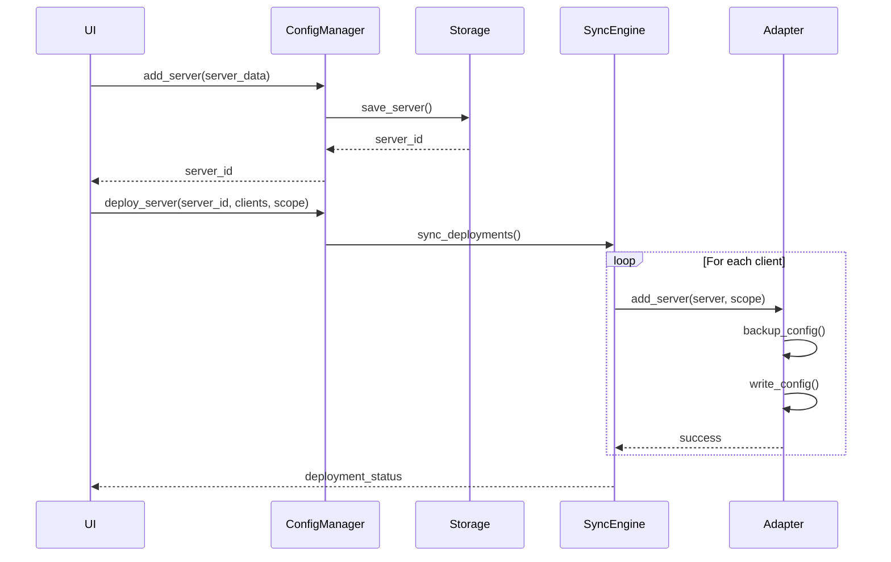
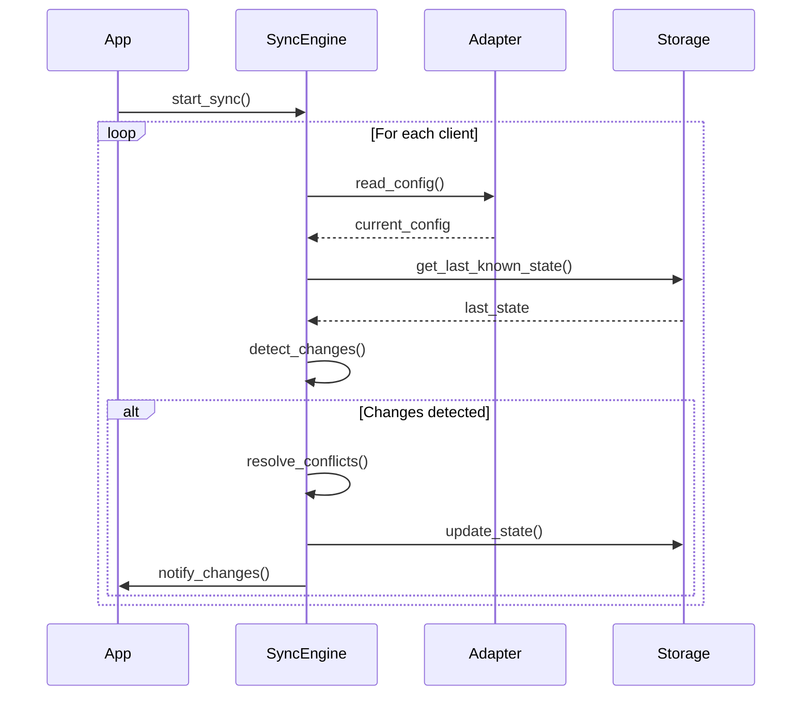

# MCP Manager - System Architecture

## Overview

MCP Manager is a cross-platform application designed to centralize the management of Model Context Protocol (MCP) servers across multiple AI client applications. The architecture follows a layered approach with a clear separation between the core business logic and presentation layers, enabling multiple UI implementations (TUI, GUI, CLI) to share the same underlying functionality.

## Design Principles

1. **Separation of Concerns**: Core logic is independent of UI implementation
2. **Platform Agnostic**: Works consistently across Windows, macOS, and Linux
3. **Extensibility**: Easy to add new client adapters and UI implementations
4. **Data Integrity**: Automatic backups before any configuration modifications
5. **Synchronization**: Bidirectional sync between app state and client configurations

## System Architecture

### High-Level Architecture

```
┌──────────────────────────────────────────────────────────┐
│                    User Interfaces                        │
│  ┌──────────────┐  ┌──────────────┐  ┌──────────────┐  │
│  │   TUI App    │  │   GUI App    │  │     CLI      │  │
│  │  (Textual)   │  │   (Future)   │  │   (Typer)    │  │
│  └──────────────┘  └──────────────┘  └──────────────┘  │
└──────────────────────────────────────────────────────────┘
                             │
                             ▼
┌──────────────────────────────────────────────────────────┐
│                      Core Library                         │
│  ┌────────────────────────────────────────────────────┐  │
│  │                  API Layer                         │  │
│  │         (Public interfaces for UI layers)          │  │
│  └────────────────────────────────────────────────────┘  │
│  ┌────────────────────────────────────────────────────┐  │
│  │                Business Logic                      │  │
│  │  ┌──────────┐  ┌──────────┐  ┌──────────────┐   │  │
│  │  │  Config   │  │   Sync   │  │    Backup    │   │  │
│  │  │  Manager  │  │  Engine  │  │   Manager    │   │  │
│  │  └──────────┘  └──────────┘  └──────────────┘   │  │
│  └────────────────────────────────────────────────────┘  │
│  ┌────────────────────────────────────────────────────┐  │
│  │                Client Adapters                     │  │
│  │  ┌──────────┐  ┌──────────┐  ┌──────────────┐   │  │
│  │  │  Claude  │  │  Claude  │  │    VSCode    │   │  │
│  │  │   Code   │  │  Desktop │  │              │   │  │
│  │  └──────────┘  └──────────┘  └──────────────┘   │  │
│  └────────────────────────────────────────────────────┘  │
│  ┌────────────────────────────────────────────────────┐  │
│  │                  Data Models                       │  │
│  │            (Pydantic-based schemas)                │  │
│  └────────────────────────────────────────────────────┘  │
└──────────────────────────────────────────────────────────┘
                             │
                             ▼
┌──────────────────────────────────────────────────────────┐
│                     Storage Layer                         │
│  ┌──────────────┐  ┌──────────────┐  ┌──────────────┐  │
│  │   SQLite DB  │  │  JSON Files  │  │   Backups    │  │
│  │  (App State) │  │ (Client Cfg) │  │  (Archive)   │  │
│  └──────────────┘  └──────────────┘  └──────────────┘  │
└──────────────────────────────────────────────────────────┘
```

## Core Library Components

### 1. Data Models (`mcp_manager/models/`)

#### MCPServer
Primary entity representing an MCP server configuration.

```python
class MCPServer:
    id: UUID                    # Unique identifier
    name: str                   # Unique machine name
    friendly_name: str          # Human-readable display name
    command: str                # Executable command
    args: List[str]            # Command arguments
    env: Dict[str, str]        # Environment variables
    type: ServerType           # Transport type (stdio, http, sse)
    tags: List[str]            # Organizational tags
    metadata: Dict[str, Any]   # Additional properties
    created_at: datetime
    updated_at: datetime
```

#### MCPClient
Represents a client application that can consume MCP servers.

```python
class MCPClient:
    name: str                          # Client identifier
    display_name: str                  # UI display name
    supported_scopes: List[Scope]      # Available deployment scopes
    config_paths: Dict[Platform, Path] # Platform-specific paths
    config_format: ConfigFormat        # JSON or TOML
    supports_env_vars: bool
    supports_inputs: bool              # VSCode-style inputs
```

#### Deployment
Represents the relationship between servers and clients.

```python
class Deployment:
    id: UUID
    server_id: UUID
    client_name: str
    scope: Scope              # global, project, user
    enabled: bool
    deployed_at: datetime
    last_sync: datetime
```

#### Scope
Deployment scope enumeration.

```python
class Scope(Enum):
    GLOBAL = "global"      # System-wide
    USER = "user"          # User-specific
    PROJECT = "project"    # Project-specific
```

### 2. Client Adapters (`mcp_manager/adapters/`)

Abstract base class defining the interface for all client adapters.

```python
class BaseAdapter(ABC):
    @abstractmethod
    def get_config_path(self, scope: Scope) -> Path
    
    @abstractmethod
    def read_config(self, scope: Scope) -> Dict[str, Any]
    
    @abstractmethod
    def write_config(self, config: Dict[str, Any], scope: Scope)
    
    @abstractmethod
    def get_servers(self, scope: Scope) -> List[MCPServer]
    
    @abstractmethod
    def add_server(self, server: MCPServer, scope: Scope)
    
    @abstractmethod
    def remove_server(self, server_name: str, scope: Scope)
    
    @abstractmethod
    def validate_config(self, config: Dict[str, Any]) -> bool
```

#### Platform-Specific Paths

Each adapter handles platform-specific configuration locations:

**Claude Code Adapter:**
- Global: `~/.claude/settings.json`
- Project: `./.claude/settings.json`

**Claude Desktop Adapter:**
- macOS: `~/Library/Application Support/Claude/claude_desktop_config.json`
- Windows: `%APPDATA%\Claude\claude_desktop_config.json`
- Linux: `~/.config/Claude/claude_desktop_config.json`

**VSCode Adapter:**
- Global: VSCode settings location
- Project: `./.vscode/mcp.json`

### 3. Configuration Manager (`mcp_manager/config/`)

Manages the application's internal state and configuration.

```python
class ConfigManager:
    def __init__(self, db_path: Path):
        self.db = SQLiteStorage(db_path)
    
    # Server operations
    def add_server(self, server: MCPServer) -> UUID
    def update_server(self, server_id: UUID, updates: Dict)
    def delete_server(self, server_id: UUID)
    def get_server(self, server_id: UUID) -> MCPServer
    def list_servers(self, filters: Dict = None) -> List[MCPServer]
    
    # Deployment operations
    def add_deployment(self, deployment: Deployment)
    def remove_deployment(self, deployment_id: UUID)
    def get_deployments(self, server_id: UUID = None) -> List[Deployment]
    
    # Bulk operations
    def deploy_servers(self, server_ids: List[UUID], clients: List[str], scope: Scope)
    def sync_all(self)
```

### 4. Sync Engine (`mcp_manager/sync/`)

Handles bidirectional synchronization between app state and client configurations.

```python
class SyncEngine:
    def __init__(self, config_manager: ConfigManager, adapters: Dict[str, BaseAdapter]):
        self.config_manager = config_manager
        self.adapters = adapters
        self.change_detector = ChangeDetector()
    
    def detect_changes(self) -> List[Change]
    def resolve_conflicts(self, changes: List[Change]) -> List[Change]
    def apply_changes(self, changes: List[Change])
    def sync_client(self, client_name: str)
    def sync_all(self)
```

#### Change Detection Algorithm

1. Read current client configurations
2. Compare with last known state
3. Identify additions, modifications, deletions
4. Generate change list with timestamps
5. Handle conflicts based on timestamp priority

### 5. Backup Manager (`mcp_manager/backup/`)

Ensures data safety through automatic backups.

```python
class BackupManager:
    def __init__(self, backup_dir: Path, retention_days: int = 30):
        self.backup_dir = backup_dir
        self.retention_days = retention_days
    
    def create_backup(self, client_name: str, config_path: Path) -> Path
    def restore_backup(self, backup_path: Path, target_path: Path)
    def list_backups(self, client_name: str = None) -> List[BackupInfo]
    def cleanup_old_backups(self)
```

#### Backup Strategy

- Create timestamped backup before any write operation
- Store backups in: `~/.mcp-manager/backups/{client}/{timestamp}/`
- Automatic cleanup of backups older than retention period
- Compression for space efficiency

## Data Flow

### Adding a New Server



### Synchronization Process



## Storage Schema

### SQLite Database Schema

```sql
-- Servers table
CREATE TABLE servers (
    id TEXT PRIMARY KEY,
    name TEXT UNIQUE NOT NULL,
    friendly_name TEXT,
    command TEXT NOT NULL,
    args TEXT,  -- JSON array
    env TEXT,   -- JSON object
    type TEXT NOT NULL,
    tags TEXT,  -- JSON array
    metadata TEXT,  -- JSON object
    created_at TIMESTAMP,
    updated_at TIMESTAMP
);

-- Deployments table
CREATE TABLE deployments (
    id TEXT PRIMARY KEY,
    server_id TEXT NOT NULL,
    client_name TEXT NOT NULL,
    scope TEXT NOT NULL,
    enabled BOOLEAN DEFAULT 1,
    deployed_at TIMESTAMP,
    last_sync TIMESTAMP,
    FOREIGN KEY (server_id) REFERENCES servers(id),
    UNIQUE(server_id, client_name, scope)
);

-- Sync state table
CREATE TABLE sync_state (
    client_name TEXT NOT NULL,
    scope TEXT NOT NULL,
    config_hash TEXT,
    last_sync TIMESTAMP,
    PRIMARY KEY (client_name, scope)
);

-- App settings table
CREATE TABLE settings (
    key TEXT PRIMARY KEY,
    value TEXT,
    updated_at TIMESTAMP
);
```

## Error Handling

### Error Categories

1. **Configuration Errors**: Invalid JSON/TOML, missing required fields
2. **Permission Errors**: Cannot read/write config files
3. **Sync Conflicts**: Divergent changes between app and client
4. **Platform Errors**: OS-specific issues
5. **Validation Errors**: Invalid server configurations

### Error Recovery Strategies

- Automatic backup restoration on write failures
- Conflict resolution UI for sync conflicts
- Graceful degradation when clients are unavailable
- Detailed error logging with context

## Security Considerations

### Sensitive Data Handling

- Environment variables containing secrets are encrypted at rest
- No logging of sensitive values
- Secure storage of API keys and tokens
- Optional password protection for app database

### File System Security

- Respect file system permissions
- Validate paths to prevent directory traversal
- Atomic file operations to prevent corruption
- User-specific configuration isolation

## Performance Considerations

### Optimization Strategies

- Lazy loading of client configurations
- Caching of frequently accessed data
- Batch operations for bulk deployments
- Async I/O for file operations
- Index optimization in SQLite

### Scalability Targets

- Support for 1000+ server definitions
- Sub-second UI response times
- Sync operations < 5 seconds for typical setups
- Minimal memory footprint (< 50MB)

## Extension Points

### Adding New Client Support

1. Create new adapter inheriting from `BaseAdapter`
2. Implement platform-specific path resolution
3. Implement config read/write methods
4. Register adapter in adapter factory
5. Add client metadata to supported clients list

### Adding New UI Implementation

1. Import core library
2. Use ConfigManager API for all operations
3. Subscribe to sync events for real-time updates
4. Implement UI-specific error handling
5. Follow established command patterns

## Dependencies

### Core Dependencies

- **pydantic** (^2.0): Data validation and models
- **pathlib**: Cross-platform path handling
- **sqlite3**: Local database (built-in)
- **json**: JSON parsing (built-in)
- **tomli**: TOML parsing
- **cryptography**: Secret encryption

### TUI Dependencies

- **textual** (^0.50): TUI framework
- **rich** (^13.0): Terminal formatting
- **typer** (^0.9): CLI framework

## Testing Strategy

### Test Categories

1. **Unit Tests**: Individual component testing
2. **Integration Tests**: Adapter and sync testing
3. **End-to-End Tests**: Full workflow testing
4. **Platform Tests**: OS-specific functionality

### Test Coverage Goals

- Core library: > 90% coverage
- Adapters: > 85% coverage
- UI components: > 70% coverage

## Deployment Architecture

### Distribution Methods

1. **PyPI Package**: `pip install mcp-manager`
2. **Standalone Executables**: PyInstaller builds
3. **Docker Container**: For server deployments
4. **Development Install**: Direct from repository

### Update Mechanism

- Automatic update checks
- Semantic versioning
- Backward compatibility for configs
- Migration scripts for schema changes

## Monitoring and Logging

### Logging Levels

- **ERROR**: Critical failures requiring user intervention
- **WARNING**: Recoverable issues and deprecations
- **INFO**: Normal operations and sync activities
- **DEBUG**: Detailed diagnostic information

### Log Storage

- Default location: `~/.mcp-manager/logs/`
- Rotation: Daily with 7-day retention
- Format: JSON for structured logging

## Future Architecture Considerations

### Phase 2 Enhancements

- Plugin architecture for custom adapters
- Remote server configuration sharing
- Team collaboration features
- Server marketplace integration

### Phase 3 Enhancements

- Cloud synchronization
- Multi-user support
- Role-based access control
- Audit logging and compliance

## Conclusion

This architecture provides a robust foundation for MCP Manager, ensuring maintainability, extensibility, and cross-platform compatibility. The layered approach enables independent evolution of UI and core logic while maintaining a consistent user experience across all platforms and client applications.