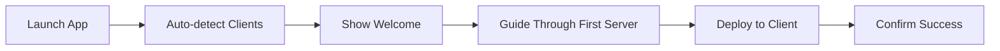

# MCP Manager TUI - Product Requirements Document

## Executive Summary

MCP Manager TUI is a terminal user interface application that provides centralized management of Model Context Protocol (MCP) servers across multiple AI client applications. Built with Python using the Textual framework, it offers an intuitive, keyboard-driven interface for developers to configure, deploy, and synchronize MCP servers without leaving the terminal.

## Product Vision

**Vision Statement**: To be the definitive tool for developers managing MCP servers, providing a seamless experience that eliminates the complexity of manual configuration across multiple AI clients.

**Mission**: Simplify MCP server management through an elegant TUI that respects developer workflows while providing powerful features for configuration, deployment, and synchronization.

## Target Users

### Primary Personas

#### 1. AI-Powered Developer
- **Profile**: Software developer using AI tools daily
- **Pain Points**: Managing different MCP configs across multiple tools
- **Needs**: Unified management, quick deployment, consistency
- **Technical Level**: High

#### 2. DevOps Engineer
- **Profile**: Manages development environments for teams
- **Pain Points**: Standardizing MCP configurations across team
- **Needs**: Bulk operations, backup/restore, deployment automation
- **Technical Level**: Expert

#### 3. AI Tool Enthusiast
- **Profile**: Early adopter exploring AI development tools
- **Pain Points**: Complex manual configuration
- **Needs**: Easy setup, discovery, experimentation
- **Technical Level**: Medium

## Core Features

### 1. Server Management

#### Server CRUD Operations
- **Create**: Add new MCP server configurations
- **Read**: View detailed server information
- **Update**: Modify existing server configurations
- **Delete**: Remove servers with cascade handling

#### Server Properties
- Unique machine name (identifier)
- Friendly display name
- Command and arguments
- Environment variables with secret handling
- Transport type (stdio, http, sse)
- Tags for organization
- Custom metadata

#### Bulk Operations
- Select multiple servers
- Bulk deployment
- Bulk deletion with confirmation
- Bulk tag management

### 2. Client Integration

#### Supported Clients
- Claude Code (all scopes)
- Claude Desktop
- VS Code with GitHub Copilot

#### Deployment Management
- Deploy to multiple clients simultaneously
- Scope selection (global, user, project)
- Deployment status tracking
- Rollback capabilities

### 3. Synchronization

#### Automatic Sync
- Startup synchronization check
- Detect external configuration changes
- Conflict detection and resolution
- Sync status indicators

#### Manual Sync
- Force sync specific clients
- Selective sync options
- Dry-run mode
- Sync history

### 4. Backup & Restore

#### Automatic Backups
- Pre-deployment backups
- Timestamped archives
- Configurable retention
- Compression support

#### Restore Options
- Browse backup history
- Selective restoration
- Point-in-time recovery
- Diff view before restore

## User Interface Design

### Layout Structure

```
┌─────────────────────────────────────────────────────────────┐
│ MCP Manager v1.0.0                              [Help] [Quit]│
├─────────────────────────────────────────────────────────────┤
│ Dashboard | Servers | Deploy | Clients | Settings | Logs     │
├─────────────────────────────────────────────────────────────┤
│                                                               │
│                     Main Content Area                         │
│                                                               │
│                                                               │
├─────────────────────────────────────────────────────────────┤
│ Status Bar | Last Sync: 2 min ago | Servers: 12 | Clients: 3 │
└─────────────────────────────────────────────────────────────┘
```

### Screen Specifications

#### Dashboard Screen
```
┌─ Quick Stats ─────────────────────────────────────┐
│ Total Servers: 12      Deployed: 28              │
│ Active Clients: 3      Last Sync: 2 minutes ago  │
└───────────────────────────────────────────────────┘

┌─ Recent Activity ─────────────────────────────────┐
│ • Deployed 'filesystem' to Claude Code (global)   │
│ • Updated 'github-api' environment variables      │
│ • Synced VS Code configuration                    │
└───────────────────────────────────────────────────┘

┌─ Quick Actions ───────────────────────────────────┐
│ [a] Add Server  [d] Deploy  [s] Sync All         │
│ [b] Backup All  [r] Refresh [h] Help             │
└───────────────────────────────────────────────────┘
```

#### Server Management Screen
```
┌─ Server List ─────────────────────────────────────────────┐
│ Name           Type   Tags          Status    Actions     │
├────────────────────────────────────────────────────────────┤
│ ▶ filesystem   stdio  [storage]     Deployed  [e][d][x]   │
│   github-api   http   [vcs, api]    Ready     [e][d][x]   │
│   sqlite-db    stdio  [database]    Deployed  [e][d][x]   │
│                                                            │
│ [↑↓] Navigate  [Space] Select  [a] Add  [e] Edit  [d] Deploy │
└────────────────────────────────────────────────────────────┘

┌─ Server Details (filesystem) ────────────────────────────┐
│ Command: npx                                             │
│ Args: -y @modelcontextprotocol/server-filesystem        │
│ Environment Variables:                                   │
│   • ALLOWED_PATHS=/home/user/projects                   │
│ Deployed to: Claude Code (global), VS Code (project)    │
└──────────────────────────────────────────────────────────┘
```

#### Deployment Matrix Screen
```
┌─ Deployment Matrix ───────────────────────────────────────┐
│              │ Claude Code │ Claude Desktop │ VS Code    │
├──────────────┼─────────────┼────────────────┼────────────┤
│ filesystem   │ ✓ Global    │ ✓              │ ✓ Project  │
│ github-api   │ ✓ User      │                │ ✓ Global   │
│ sqlite-db    │             │ ✓              │            │
│ docker-mgmt  │ ✓ Project   │                │ ✓ Project  │
│                                                           │
│ [↑↓←→] Navigate  [Space] Toggle  [s] Scope  [Enter] Apply │
└───────────────────────────────────────────────────────────┘
```

#### Client Status Screen
```
┌─ Client Status ───────────────────────────────────────────┐
│ Client         │ Status  │ Config Path                    │
├────────────────┼─────────┼────────────────────────────────┤
│ Claude Code    │ ✓ Ready │ ~/.claude/settings.json        │
│ Claude Desktop │ ✓ Ready │ ~/Library/.../claude_config    │
│ VS Code        │ ✓ Ready │ .vscode/mcp.json              │
│                                                           │
│ [r] Refresh  [s] Sync Selected  [a] Sync All  [v] View   │
└───────────────────────────────────────────────────────────┘
```

### Navigation

#### Keyboard Shortcuts

**Global Shortcuts**
- `Tab` / `Shift+Tab`: Navigate between panels
- `Ctrl+Q`: Quit application
- `Ctrl+S`: Save current changes
- `Ctrl+Z`: Undo last action
- `?` or `F1`: Show help
- `Ctrl+L`: Clear and refresh screen

**Navigation**
- `↑` `↓`: Move selection up/down
- `←` `→`: Move between columns
- `Page Up/Down`: Scroll pages
- `Home/End`: Jump to first/last item
- `1-5`: Quick jump to tabs

**Actions**
- `a`: Add new item
- `e`: Edit selected item
- `d`: Delete/Deploy (context-aware)
- `Space`: Toggle selection
- `Enter`: Confirm/Open
- `Esc`: Cancel/Back

### Color Scheme

#### Default Theme (Dark)
- **Background**: #1e1e1e (VSCode dark)
- **Primary**: #007ACC (Blue)
- **Success**: #4EC9B0 (Teal)
- **Warning**: #CE9178 (Orange)
- **Error**: #F48771 (Red)
- **Text**: #D4D4D4 (Light gray)
- **Border**: #3C3C3C (Dark gray)

#### Status Indicators
- 🟢 Green: Deployed/Active
- 🟡 Yellow: Pending/Warning
- 🔴 Red: Error/Offline
- ⚪ Gray: Inactive/Disabled

### Forms and Inputs

#### Add/Edit Server Form
```
┌─ Add New Server ──────────────────────────────────────┐
│ Name*:         [filesystem_server___]                 │
│ Display Name:  [File System Server__]                 │
│ Command*:      [npx_________________]                 │
│ Arguments:     [____________________]                 │
│                [+ Add Argument]                       │
│ Type:          [◉ stdio ○ http ○ sse]                │
│                                                        │
│ Environment Variables:                                │
│ Key:    [____________] Value: [____________] [+Add]   │
│                                                        │
│ Tags:          [storage, local_____]                  │
│                                                        │
│ [Save] [Cancel]                     * Required fields │
└────────────────────────────────────────────────────────┘
```

## User Workflows

### Primary Workflows

#### 1. First-Time Setup


#### 2. Add and Deploy Server
1. Press `a` on Servers tab
2. Fill in server details
3. Save server
4. Navigate to Deploy tab
5. Select target clients and scopes
6. Confirm deployment
7. View deployment status

#### 3. Sync External Changes
1. App detects changes on startup
2. Shows sync notification
3. User reviews changes
4. Resolves any conflicts
5. Applies synchronization

#### 4. Bulk Deployment
1. Select multiple servers with `Space`
2. Press `d` for deploy
3. Choose target clients
4. Select scope for each
5. Confirm bulk operation
6. Monitor progress

### Error Handling

#### Error Types and Recovery

**Configuration Errors**
- Display: Red banner with error details
- Recovery: Offer to restore from backup
- Example: "Invalid JSON in config file"

**Permission Errors**
- Display: Warning dialog
- Recovery: Provide fix instructions
- Example: "Cannot write to /etc/config"

**Sync Conflicts**
- Display: Conflict resolution screen
- Recovery: Choose local/remote/merge
- Example: "Server exists in both sources"

**Network Errors**
- Display: Status bar indicator
- Recovery: Retry with backoff
- Example: "Cannot reach remote server"

### Notifications

#### Notification Types

**Success Notifications**
- Color: Green
- Duration: 3 seconds
- Position: Top-right corner
- Example: "✓ Server deployed successfully"

**Warning Notifications**
- Color: Yellow
- Duration: 5 seconds
- Position: Top-right corner
- Example: "⚠ Backup is 7 days old"

**Error Notifications**
- Color: Red
- Duration: Until dismissed
- Position: Center modal
- Example: "✗ Failed to deploy server"

## Performance Requirements

### Response Time Targets
- UI Navigation: < 50ms
- Form Submission: < 200ms
- Client Detection: < 1 second
- Full Sync: < 5 seconds
- Search/Filter: < 100ms

### Resource Constraints
- Memory Usage: < 50MB
- CPU Usage: < 5% idle
- Disk I/O: Minimal, batch operations
- Network: Only for remote servers

### Scalability Targets
- Servers: Support 1000+ definitions
- Clients: Support 10+ simultaneously
- Tags: 50+ per server
- Backups: 100+ archived

## Accessibility

### Keyboard Accessibility
- Full keyboard navigation
- No mouse required
- Consistent shortcuts
- Vi-style keys support

### Screen Reader Support
- Semantic text output
- Status announcements
- Focus indicators
- High contrast mode

### Visual Accessibility
- Configurable colors
- Large text option
- Clear focus indicators
- No color-only information

## Configuration

### User Preferences
```toml
[ui]
theme = "dark"  # dark, light, high-contrast
compact_mode = false
show_hints = true
confirm_destructive = true

[behavior]
auto_sync_on_start = true
auto_backup = true
backup_retention_days = 30

[shortcuts]
# Customizable keyboard shortcuts
add_server = "a"
deploy = "d"
sync = "s"
```

### Advanced Settings
- Custom color schemes
- Plugin support
- Export/Import settings
- Telemetry opt-in/out

## Help System

### Integrated Help
- Context-sensitive help
- Keyboard shortcut reference
- Interactive tutorial
- Searchable documentation

### Help Content Structure
```
┌─ Help ────────────────────────────────────────────┐
│ Navigation                                        │
│   Tab       - Switch panels                       │
│   ↑/↓       - Move selection                      │
│   Enter     - Select/Confirm                      │
│                                                    │
│ Server Management                                 │
│   a         - Add new server                      │
│   e         - Edit server                         │
│   d         - Deploy server                       │
│                                                    │
│ [↑↓] Browse  [/] Search  [Esc] Close             │
└────────────────────────────────────────────────────┘
```

## Integration Points

### CLI Integration
```bash
# Launch TUI
mcp-manager tui

# Direct commands
mcp-manager add-server --name "test" --command "npx"
mcp-manager deploy --server "test" --client "claude-code"
mcp-manager sync --all
```

### Import/Export
- Export server definitions to JSON
- Import from existing configs
- Share server collections
- Team configuration templates

## Testing Requirements

### Functional Testing
- All CRUD operations
- Navigation flows
- Form validation
- Error handling
- Sync operations

### Usability Testing
- First-time user experience
- Common workflow completion
- Error recovery paths
- Help system effectiveness

### Performance Testing
- Load testing with 1000+ servers
- UI responsiveness under load
- Memory leak detection
- Startup time optimization

## Success Metrics

### Key Performance Indicators
- Time to first deployment: < 2 minutes
- Successful deployment rate: > 95%
- Sync conflict rate: < 5%
- User error rate: < 10%

### User Satisfaction Metrics
- Task completion rate
- Time on task
- Error frequency
- Feature adoption rate

## Launch Requirements

### MVP Features (Phase 1)
- ✅ Server CRUD operations
- ✅ Multi-client deployment
- ✅ Basic synchronization
- ✅ Automatic backups
- ✅ Keyboard navigation
- ✅ Help system

### Post-Launch Features (Phase 2)
- Advanced search and filtering
- Server templates
- Batch operations
- Configuration profiles
- Plugin system
- Remote server support

### Future Enhancements (Phase 3)
- Team collaboration
- Cloud synchronization
- Server marketplace
- AI-powered suggestions
- Monitoring dashboard
- Automated testing

## Risk Mitigation

### Technical Risks
- **Risk**: Config file corruption
- **Mitigation**: Automatic backups, validation

- **Risk**: Client API changes
- **Mitigation**: Adapter pattern, version detection

- **Risk**: Platform differences
- **Mitigation**: Extensive testing, CI/CD

### User Experience Risks
- **Risk**: Complexity overwhelm
- **Mitigation**: Progressive disclosure, tutorials

- **Risk**: Destructive operations
- **Mitigation**: Confirmations, undo support

## Documentation Requirements

### User Documentation
- Quick start guide
- Keyboard reference card
- Video tutorials
- FAQ section
- Troubleshooting guide

### Developer Documentation
- API reference
- Plugin development guide
- Contributing guidelines
- Architecture overview

## Compliance and Security

### Security Requirements
- Secure storage of secrets
- No telemetry without consent
- Local-only operation option
- Audit logging capability

### Privacy Requirements
- No PII collection
- Optional analytics
- Clear data handling policy
- GDPR compliance ready

## Release Planning

### Version 1.0.0 (MVP)
- Core functionality
- Three client support
- Basic UI complete
- Documentation ready

### Version 1.1.0
- Advanced search
- Bulk operations
- Performance improvements
- Bug fixes from 1.0

### Version 2.0.0
- Plugin system
- Remote servers
- Team features
- GUI application

## Conclusion

The MCP Manager TUI represents a significant improvement in developer experience for managing MCP servers. By providing a unified, efficient, and user-friendly interface, it eliminates the complexity of manual configuration while maintaining the flexibility developers need. The focus on keyboard-driven interaction, comprehensive error handling, and robust synchronization ensures that developers can confidently manage their MCP server deployments across all their AI development tools.